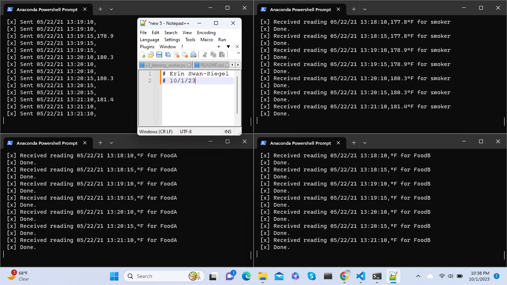

# 44671_Mod05 - Creating a Producer

Streaming data may come from web analytics, social media, smart devices, and more. In these next two modules, we'll look at implementing analytics for a "smart smoker" (as in slow cooked food). 

In Module 5, we'll understand the process, design our system, and implement the producer. In Module 6, we'll add the consumers, implementing analytics based on a rolling window of time, and raise an alert when interesting events are detected.  

- Course: 44-671 : Module 05 & 06
- Student: Erin Swan-Siegel
- Date: 09-22-2023 / 9-29-2023

# Instructions
1. Fork this starter repo into your GitHub.
1. Clone your repo down to your machine.
1. View / Command Palette - then Python: Select Interpreter
1. Select your conda environment. 

## RabbitMQ Admin 

RabbitMQ comes with an admin panel. When you run the task emitter, reply y to open it. 

(Python makes it easy to open a web page - see the code to learn how.)

## Edit your constants
The file v3_emitter_of_tasks.py contains the below constants. Review and adjust where required prior to executing the producer.
- file_name : CSV for the file to be read
- sleep_secs : the amount of time (in seconds) between each sent message
- host : define the host name
- queue_01 : Temperature of Smoker
- queue_02 : Temperature of Food A
- queue_03 : Temperature of Food B

## Execute the Producer

1. Run v3_emitter_of_tasks.py (say y to monitor RabbitMQ queues)
1. The producer will create 3 separate queues, with each column of the source file being read into a separate queue, along with the associated timestamp found in the file

## Execute the Consumers
1. Run smoker_consumer, foodA_consumer2, and foodB_consumer2
1. Each set/column of temperature values is delivered to its own queue
1. Each record with a valid associated temperature value is assumed to be 30 second apart; recorded timestamps and records without the targeted temperature value recorded are ignored at this time.
1. Each consumer contains its own analytics to notify the user if temperatures behave in a way that indicates a problem in the smoking process, including if the smoker loses temperature over 2.5 mins or if the food temperature of either of the two foods stalls out (< 1°F change in 10 mins)
1. Each consumer process can be haulted with a Ctrl + C command

## References
- Assignment: https://nwmissouri.instructure.com/courses/54849/assignments/857700?module_item_id=1893393
- Prompt: https://nwmissouri.instructure.com/courses/54849/pages/smart-smoker 
- Guidance 5.1: https://nwmissouri.instructure.com/courses/54849/pages/module-5-dot-1-guided-producer-design?wrap=1 
- Guidance 5.2: https://nwmissouri.instructure.com/courses/54849/pages/module-5-dot-2-guided-producer-implementation?wrap=1

## Screenshots
- A running example of the emitter and RabbitMQ queue names and respective counters

- A running example of  the emitter and each food queue consumer:

- Smoker Alert

- FoodB Alert
